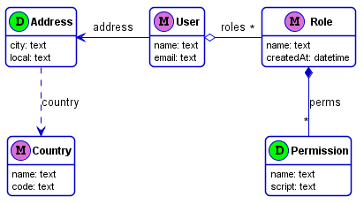

# FatCoach (experimental)
An experimental alternative to GraphQL for relational databases.

#### The lazy coach who helps you achieve your goal.
FatCoach is a Back-End as a Service (BaaS) framework (in Kotlin) which abstracts the underlying SQL database from Front-End developers.
Front-end developers use a domain-specific language (DSL) to input data and to query the database. 

FatCoach shares a similar purpose to [GraphQL](https://graphql.org); however, with a different philosophy and architecture. GraphQL was designed mainly for interoperability, and because of that it cannot expose a flexible query DSL to the Front-End. A powerful query language requires an assumption of the underlying database and its capabilities. GraphQL cannot expose SQL features because the data source could be a REST service instead.  

FatCoach is more opinionated about the model and assumes certain datasource capabilities. Because of that, FatCoach is able to expose a powerful query engine to the Front-End. Furthermore, every DSL instruction can be intercepted and checked with plugable security adaptors for access control.

### Example Schema
FatCoach doesn't have a DSL for the schema. The schema is directly defined via the Kotlin language. However, it doesn't have the same rigid structure like [Exposed](https://github.com/JetBrains/Exposed). The Schema can be defined at runtime with the possibility of being used as a framework for Headless CMS.

Lets assume the following data model in UML:



* Entities are categorized as Master or Detail. The underlying logic for the master/detail structure is that it works as a unit. A detail entity must be owned by one and only one entity. A master has no owners, it's a top entity. When such a master/detail connection exists, this generally means that both entities are created in the same business process. The top master entity and the corresponding owned tree structure is designated as an island structure. 

* @id and @parent are reserved property names. @id is automatically provided by the framework to uniquely identity entries. @parent is the master's reference provided in detail entities.

* Other properties are categorized as fields and relations. Relations are references and collections, and are categorized as owned or linked. An entity always owns another detail entity via an owned relation, forming structured islands. Links are normally used to connect different islands.     

Given the example, existing structured islands are: (```User```, ```Address```), (```Role```, ```Permission```) and (```Country```). Island connections, or linked relations are: ```User::roles``` and ```Address::country```.
This modeling scheme is very useful to isolate and identify different parts of the model that are normally associated to different purposes. It also easily identifies master/details structures that are normally related with UI design patterns, alleviating the model mismatch between the DB and UI.

The schema is defined in Kotlin via:
```kotlin
val schema = FcSchema {
  val Country = master("Country") {
    text("name")
    text("code")
  }

  val Role = master("Role") {
    text("name")
    datetime("createdAt") {
      deriveFrom { LocalDateTime.now() }
    }

    ownedCol("perms", detail("Permission"){
      text("name")
      text("script")
    })
  }

  master("User") {
    text("name")
    text("email") {
      checkIf { it.contains('@') }
    }

    linkedCol("roles", Role)

    ownedRef("address", detail("Address") {
      text("city")
      text("local")
      linkedRef("country", Country)
    })
  }
}
```

### Input DSL
* Creating two ```Country``` entries and returning the ids, @id = [1, 2].
```graphql
Country {
  name: "Spain",
  code: "ES"
}

Country {
  name: "Portugal",
  code: "PT"
}
```

* Creating two ```Role``` entries with owned ```Permission``` entries and returning @id = [1, 2].
```graphql
Role {
  name: "admin",
  perms: [
    { name: "activate-some", script: "some-js-script-1" },
    { name: "activate-all", script: "some-js-script-2" }
  ]
}

Role {
  name: "operator",
  perms: [
    { name: "disable-some", script: "other-js-script-1" },
    { name: "disable-all", script: "other-js-script-2" }
  ]
}
```

* Creating a ```User``` entry with an owned ```address``` referencing the ```Country``` entry, and a list of ```Role``` references. Returning @id = 1.
```graphql
User {
  name: "Alex",
  email: "alex@mail.com",
  roles: [1, 2]
  address: {
    city: "Barcelona",
    local: "A place for a Home",
    country: 1
  }
}
```

* Updating the ```User``` name and removing the ```Role``` where @id = 1.
```graphql
User @id == 1 {
  name: "Alex Dupon",
  roles: @del 1
}
```

* Adding another ```Address``` detail to the ```User``` via create, using the @parent reference.
```graphql
Address {
  @parent: 1,
  city: "Aveiro",
  local: "Another place to live!",
  country: 2
}
```

### Query DSL
A query returns a sub-tree snapshot of the database graph. 

* Queering ```User``` entries filtered by ```User::name``` and ```User::address.country.name```. Returns a JSON structure for the selected fields, including the inner fields for the Address reference. The ```*``` symbol is the selector for all fields. 
```graphql
User | name == "Alex" and address.country.name == "Spain" | {
  name,
  address {
    city,
    country { * }
  }
}
```

* Page and limit can be applied after the filter (if exists).
```graphql
User limit 2 page 1 { * }
```

* Sorting can be applied to each field.
```graphql
User {
  (asc 1) name,
  (dsc 2) email
}
```

* Sub-filters can be applied to collections.
```graphql
User {
  *,
  roles | name == "admin" | { * }
}
```

* Query parameters can be used in multiple places.
```graphql
User | name == ?name and address.city == "Aveiro" | limit ?limit {
  name,
  roles { * }
}
```

### Setup Test Environment
* Get the FatCoach project:
```
npx degit shumy-tools/fatcoach fc-test
cd fc-test
```

* In console 1) Setup and start the Kotlin server:
```
./gradlew build
./gradlew :fc-template:server:run
```

* In console 2) Setup and start the Web Dev server:
```
cd fc-template/client
npm install
npm run dev
```

* Open the example web console at 'http://localhost:8080/'.
* Insert 2 ```Country``` entries and query results (press F9 to execute commands):
```graphql
create Country {
  name: "Portugal",
  code: "PT"
}
```

```graphql
create Country {
  name: "Spain",
  code: "ES"
}
```

```graphql
query Country | code == "PT" | { * }
```

* Change the model and configuration to your desire in ```fc-template/server/src/main/kotlin/Server.kt```.
